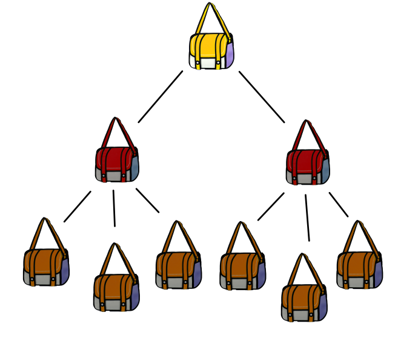

# Day 7: Handy Haversacks

## Problem statement (part 1)

Given a list of rules regarding bags, find out on which bags you can place your **shiny gold** bag.

### Input

The input contains the following rules:

```
light red bags contain 1 bright white bag, 2 muted yellow bags.
dark orange bags contain 3 bright white bags, 4 muted yellow bags.
bright white bags contain 1 shiny gold bag.
muted yellow bags contain 2 shiny gold bags, 9 faded blue bags.
shiny gold bags contain 1 dark olive bag, 2 vibrant plum bags.
dark olive bags contain 3 faded blue bags, 4 dotted black bags.
vibrant plum bags contain 5 faded blue bags, 6 dotted black bags.
faded blue bags contain no other bags.
dotted black bags contain no other bags.
```

Each line contains a rule of what each colored bag can contain inside it. For example, the first line indicated that any `light red` bags can contain one `bright white` bad and up to two `muted yellow` bags. In essence, the `light red` can not directly contain any other color than these two; it can, however, have a variable number of these, as long it doesn't exceed the given value.

### Output

We need to store our `shiny gold` bag somewhere. At first glance, we see that both `muted yellow` and `bright white` bags can hold our bag directly. However, it is also possible to hold our bag **indirectly**; the `light red` and `dark orange` bags both accept `bright white` and/or `muted yellow` bags, which in turn accept our `shiny gold`. Therefore, we have **4** valid colors to place our bag on, and our final answer is `4`.

## Problem statement (part 2)

The problem for part 2 changes a bit; we now want to know how many bags does our `shiny gold` bag must contain.

### Input

Let's switch input to this case, to be a bit more clear:

```
shiny gold bags contain 2 dark red bags.
dark red bags contain 2 dark orange bags.
dark orange bags contain 2 dark yellow bags.
dark yellow bags contain 2 dark green bags.
dark green bags contain 2 dark blue bags.
dark blue bags contain 2 dark violet bags.
dark violet bags contain no other bags.
```

### Output

This is a typical "turtles all the way down" problem: we need to find the total amount of bags inside ours. For starters, the `shiny gold` bag has 2 `dark red` bags. These ones, in turn, have 2 `dark orange` bags; and so on, until we eventually find a bag which contains no other *(`dark violet`, in our case)*. So, the final value is `2 + 2 * (2 + 2 * (2 + 2 * (2 + 2 * (2 + 2 * (2 + 2 * (0)))))) = 126`.

If the above math was kinda confusing, let us look at a smaller example:

```
shiny gold bags contain 2 dark red bags.
dark red bags contain 3 dark orange bags.
dark orange bags contain no other bags.
```

We first look at the `shiny bag`. We know it can contain `2` bags. Now, each one of those bags may have more stuff inside it. The math looks like `2 + 2 * (...)` right now.

Now, we move on to the `dark red` bag. We know these contain 3 `dark orange` bags. And those bags might also contain something in it. So, the math now looks like `2 + 2 * (3 + 3 * (...))`

We move one to the `dark orange` bags. Here, we're told this bag doesn't contain anything. Well, that's just a `0` then. The final sum is, therefore, `2 + 2 * (3 + 3 * (0))` = `8`.

If you draw a tree, you can see this more clearly:



If you cound the bags *(excluding the shiny gold bag, of course)*, you can see it holds a total of **8** bags, just like we calculated above.

## Algorithm analysis

Just like the previous algorithms, we pre-format our input before starting, to make the algorithm simpler to read.

We format it as a dictionary, indexed by the bag's colour, which then holds a list of tuples. Each tuple represents the amount and color of bags this bag holds. Therefore, we have all the info needed neatly pre-arranged to process.

For this problem, we finally have to tackle recursion; for part 1, we have to find direct and indirect colors that can hold our bag. For that, we visit each bag, and for that bag, visit it's color, and so on, to see if any of those colors can hold our `shiny gold` bag.

For part 2, we also have similar recursion, but now we need to count the bags that are inside `shiny gold`. So, simple: our root bag is the `shiny gold` one, we count the bags it contains, and for each of those bags, we perform the same calculus recursively, until we hit bags that don't contain anything inside it. Values propagate up, and we get our final answer.

### Time and memory complexity

For the analysis below, the following variables have these meanings:

- `n` means the size of the input

**Time** complexity is bad: we pre-process our input, which gives us **O(n)** for starters. But the real problem is recursion: we still need to process every `n` bag, but the recursion might visit those bags `n` times as well. Therefore, and for both parts *(part 2 follows the same routine)*, we get complexity **O(n²)**.

**Memory** complexity, on the other hand, is nothing extraordinary: we have our input, as always, and our pre-processes input, of the same size. Other than that, no more memory is needed. Therefore, **O(n)**.